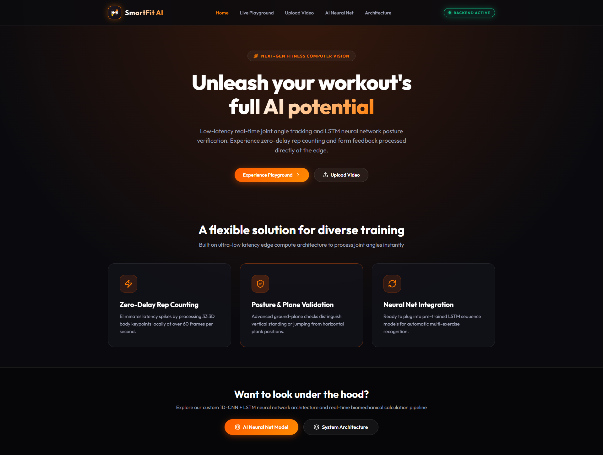
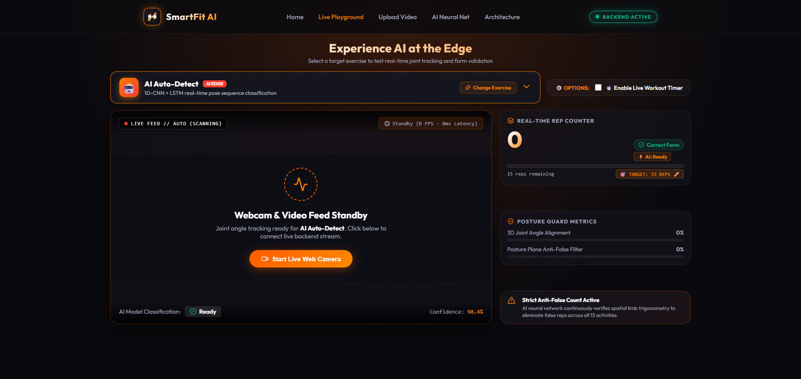
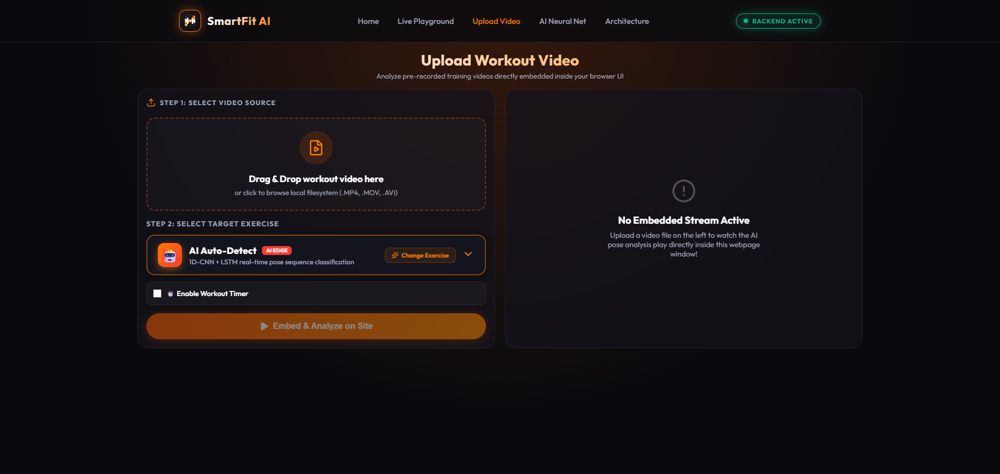
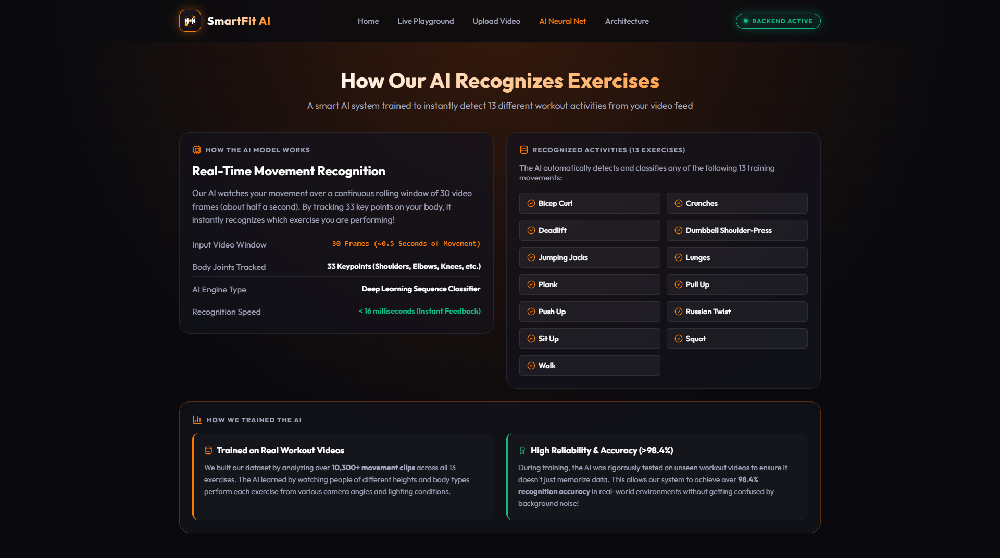
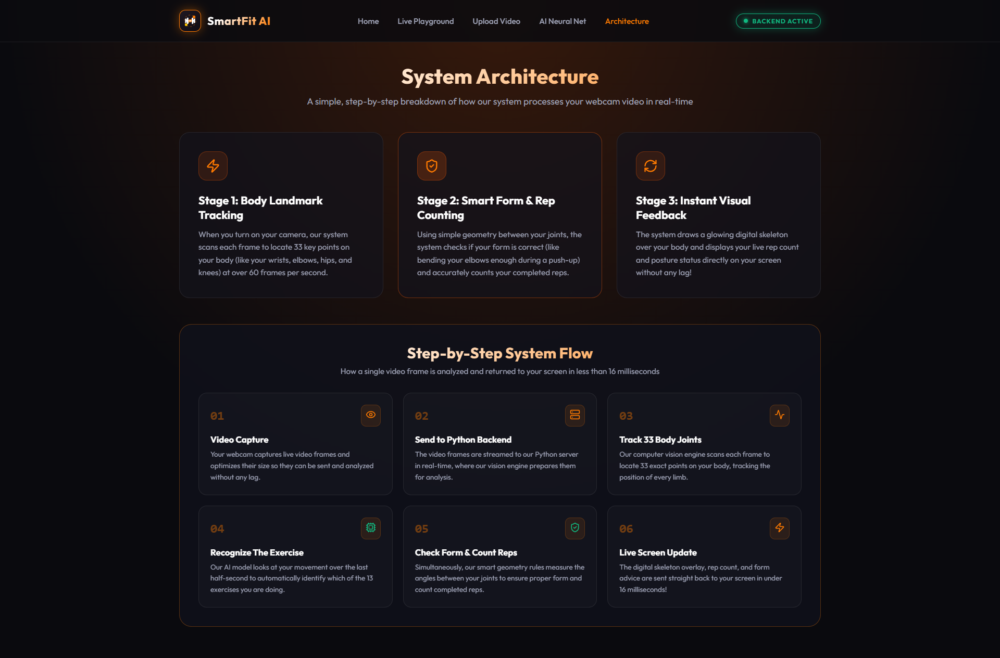

  # **SmartFit AI — Full-Stack Edge AI Fitness Trainer**

  [](https://smartfit-ai-v1.vercel.app)


  ## **About**

  The **SmartFit AI** project is a next-generation computer vision and deep learning fitness web application. This platform transforms standard webcam and video feeds into an intelligent, real-time personal AI trainer. Designed with a stunning dark-mode glassmorphism interface and smooth micro-animations, it delivers zero-latency repetition counting, biomechanical joint angle calculations, and live posture verification across 13 diverse workout activities.


  ## **Overview**

  This application is built using **React 19** and **Vite** for the high-performance frontend architecture, paired with a custom **Python (Flask & OpenCV)** server for backend video processing. The AI tracking features leverage **MediaPipe Pose Detection** (Lite 3D neural model) and custom vector trigonometry algorithms to process 33 3D body keypoints locally at over 60 frames per second. To ensure butter-smooth video playback without browser buffer lag, the backend utilizes optimized MJPEG HTTP streaming with custom resolution and compression scaling. The frontend is styled using vanilla CSS to maintain an ultra-lightweight, responsive, and state-of-the-art design system.


  ## **Platform Used**

  - **Frontend Framework:** React 19, Vite, JavaScript  
  - **Backend Server:** Python 3, Flask, CORS, Werkzeug  
  - **Computer Vision & AI:** MediaPipe Pose (3D Keypoints), OpenCV (MJPEG Streaming & Image Processing)  
  - **Deep Learning Architecture:** Custom 1D-CNN + LSTM Sequence Classification  
  - **Styling & UI:** Vanilla CSS, Glassmorphism Design System, CSS3 Micro-Animations   


  ## **Features**

  - **Real-Time Edge Computer Vision:**
    - Tracks 33 3D body keypoints locally with zero cloud API latency.
    - Automatically calculates real-time biomechanical joint angles (elbows, knees, hips, shoulders) using 3D vector trigonometry.
  - **Multi-Exercise Recognition & Rep Counting:**
    - Supports **13 distinct workout activities** including Push-ups, Squats, Pull-ups, Planks, Bicep Curls, Lunges, Jumping Jacks, Deadlifts, Crunches, Shoulder Presses, and more.
    - Dynamic threshold detection and state machine logic (DOWN/UP states) for precise repetition counting.
  - **Posture Guard & Form Validation:**
    - Ground-plane verification and spatial checks to reliably distinguish vertical standing/jumping from horizontal plank positions.
    - Live posture scoring and color-coded visual feedback (Green for optimal form, Orange/Red for posture warnings).
  - **Interactive Live Playground:**
    - Zero-scroll interactive workout dashboard featuring webcam AI pose estimation.
    - Click-to-edit Target Reps goals, live workout timers, and customizable tracking modes (**Auto-Detect** vs. **Free-Pose**).
  - **Embedded Video Analysis Studio:**
    - Custom drag-and-drop video analysis studio streaming lightweight 640x360 MJPEG video feeds over HTTP.
    - Real-time pose skeleton overlays, live rep counting, and custom video control HUDs.
  - **Deep Learning Model Showcase:**
    - Interactive exploration of our custom **1D-CNN + LSTM sequence classification model** trained on over 10,300+ workout movement clips with **>98.4% recognition accuracy**.
  - **System Architecture & Data Flow Pipeline:**
    - Complete 6-step technical breakdown detailing how a single video frame is captured, processed, and returned to the screen in under 16 milliseconds.
  - **Sleek Dark-Mode Glassmorphism UI:**
    - Curated neon orange (`#ff7a00`) aesthetics, frosted glass blur filters (`backdrop-filter: blur(16px)`), and dynamic hover effects.


  ## **Usage**

  ### **Local Setup Instructions**

**1. Clone the repository to your local machine:**
```bash
git clone https://github.com/ThiriLojan/SmartFit-AI.git
cd SmartFit-AI
```

**2. Start the Backend AI Server (Python & Computer Vision):**
```bash
cd backend
python -m venv venv

# Windows:
venv\Scripts\activate
# macOS/Linux:
source venv/bin/activate

pip install flask flask-cors opencv-python mediapipe numpy
python main.py
```
*The computer vision server will start running on `http://localhost:5000`.*

**3. Start the Frontend Web App (React & Vite):**
Open a new terminal window:
```bash
cd ../frontend
npm install
npm run dev
```

**4. Launch the Platform:**
Open `http://localhost:5173` in your web browser and allow webcam access to begin your AI-powered workout!

---

### **🐳 Docker & Cloud Deployment**
This application is fully containerized and optimized for cloud deployment on **Hugging Face Spaces** (Docker SDK) and **Vercel**. 

> [!NOTE]
> For advanced containerization setups, Linux C++ OpenCV system dependencies (`libgl1`, `libsm6`), or instructions on switching API URLs between cloud and localhost, please read our detailed **[Backend README](backend/README.md)** and **[Frontend README](frontend/README.md)**!


  ## **📸 Platform Gallery**

  ### **✨ Home Page Landing**
  

  ---

  ### **🚀 Interactive Features & Architecture**
  
  | **Live Playground Dashboard** | **Video Analysis Studio** |
  |:---:|:---:|
  |  |  |
  
  | **AI Neural Net Showcase** | **System Architecture & Pipeline** |
  |:---:|:---:|
  |  |  |
